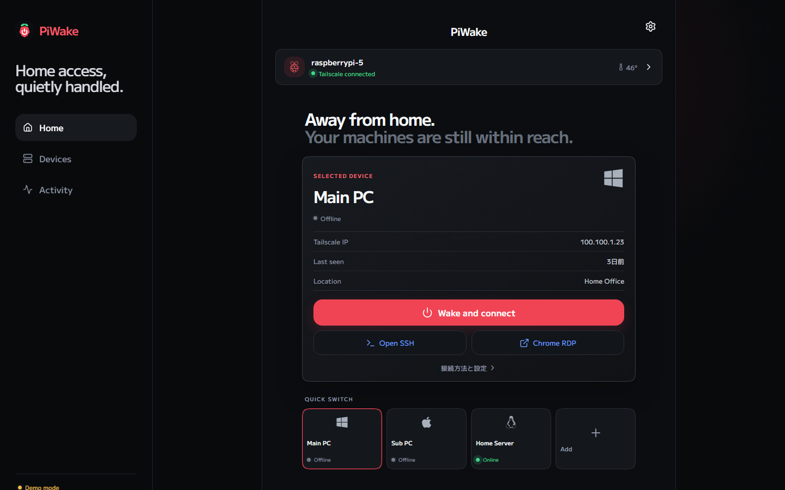
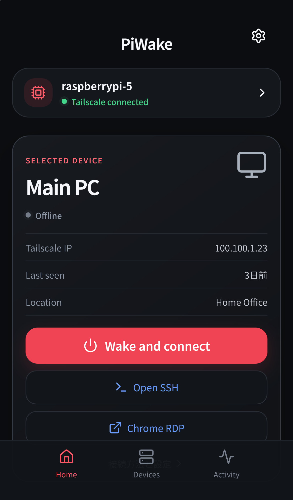

<p align="center"></p>

<p>
  
  
  
  
</p>

Turn your Raspberry Pi into a Wake-on-LAN relay and wake, watch, and connect to your home machines from anywhere — over Tailscale, with **zero exposed ports**.

**日本語 README: [README.md](README.md)**

| Desktop | Mobile |
| --- | --- |
|  |  |

## Features

- **Wake-on-LAN with staged tracking** — the Pi sends the magic packet, then walks the wake through `packet sent → responding → reachable over Tailscale → SSH/RDP ready`, with a browser notification when the machine is up. Not just fire-and-forget.
- **Scheduled wakes** — "weekdays at 07:30" style automation, evaluated in the Pi's local time.
- **Pinning** — keep your daily machines at the top of the list.
- **Remote shutdown** — power machines off over key-based SSH from the Pi; shut down the Pi itself too.
- **Live device status** — 10-second ping polling pushed to the UI over Server-Sent Events.
- **Network scan** — one-tap adding of LAN devices discovered from the Pi's ARP table.
- **Connection launchpad** — SSH (custom ports, command copied to clipboard), Chrome Remote Desktop, RDP, and custom web URLs (NAS dashboards, Proxmox, …), each with **live port-probe status**. Per-device SSH user/port, RDP port and web URL are stored server-side and shared between web and mobile.
- **OS icons** — tag each device as Windows / macOS / Linux / Raspberry Pi and its logo (Font Awesome Brands) shows everywhere.
- **Font picker** — eight curated Japanese Google Fonts (M PLUS 1 by default), switchable in Settings and embedded at runtime instead of bundled.
- **Simple mode** — open `/simple` for a single-screen dashboard: every device as a card with direct Wake / Ping / SSH / RDP / shutdown buttons, no tabs, concurrent wakes with inline progress.
- **Discord bot** — `/wake`, `/shutdown`, `/devices` and `/status` slash commands with device-name autocomplete. Connects outbound to the Discord gateway, so no ports are opened and the zero-dependency rule holds (Node.js 22+; auto-disables otherwise). Configure `PIWAKE_DISCORD_TOKEN` / `PIWAKE_DISCORD_APP_ID` (plus optional `PIWAKE_DISCORD_GUILD` and `PIWAKE_DISCORD_ALLOWED_USERS`) in `/etc/default/piwake`.
- **Host monitoring** — CPU temperature, load average, uptime, Tailscale state.
- **PWA** — add it to your phone's home screen and it behaves like a native app, with a service-worker offline shell.
- **Mobile UI** — icon-only capsule tab bar with a single EaseOut moving indicator under the selected item; only the active icon glows.
- **Native mobile app** — a React Native (Expo) app ships in [mobile/](mobile/); run it instantly with Expo Go.
- **Security** — Tailscale-first (no open ports), optional bearer-token auth, built-in DNS-rebinding and CSRF protection.

## Install on the Pi

Requirements: any Linux (Raspberry Pi OS recommended), Node.js 18+, Tailscale.

```bash
git clone https://github.com/nisesimadao/PiWake.git
cd PiWake
bash deploy/install.sh
```

The installer builds the web console, writes `/etc/default/piwake`, and registers a `piwake` systemd service (state lives in `/var/lib/piwake`). Then open `http://<pi-tailscale-ip>:8787` from any device on your tailnet.

The API server uses **only the Node.js standard library** — http, dgram, net, child_process. No npm dependencies to audit.

### Configuration (`/etc/default/piwake`)

| Variable | Default | Description |
| --- | --- | --- |
| `PIWAKE_PORT` | `8787` | API / web console port |
| `PIWAKE_TOKEN` | (empty) | Bearer token (recommended — `openssl rand -hex 16`; enter the same value in Settings) |
| `PIWAKE_BROADCAST` | `255.255.255.255` | Magic packet broadcast address, e.g. `192.168.1.255` |
| `PIWAKE_WAKE_TIMEOUT` | `90` | Seconds to wait for a device to come up |
| `PIWAKE_STATUS_INTERVAL` | `10` | Device ping interval in seconds |
| `PIWAKE_ALLOWED_HOSTS` | (empty) | Extra allowed Host headers (comma-separated); IPs, own hostname and MagicDNS are allowed automatically |

### Remote shutdown prerequisites

- **Managed PCs**: set up key-based SSH from the Pi (`ssh-copy-id user@pc`); on Linux allow passwordless `sudo shutdown`.
- **The Pi itself**: `pi ALL=(root) NOPASSWD: /usr/sbin/shutdown` in sudoers.

## Development

```bash
npm install
npm run dev        # demo mode — full UI without any API
npm run server     # API only (http://localhost:8787)
npm start          # build + serve API and web console
```

Production builds talk to the same-origin API by default; demo mode only activates in `npm run dev` (without an API URL) or with `VITE_PIWAKE_MODE=demo`.

```bash
npm test   # unit + API integration tests via node:test (zero dependencies)
```

## API

| Method | Path | Purpose |
| --- | --- | --- |
| `GET` | `/api/health` | Liveness (no auth; reports `authRequired`) |
| `GET` | `/api/events` | SSE stream (device status & wake job updates) |
| `GET` | `/api/host` | Host metrics |
| `POST` | `/api/host/shutdown` | Shut down the Pi |
| `GET/POST` | `/api/devices` | List / add devices |
| `PATCH/DELETE` | `/api/devices/:id` | Update / remove a device |
| `POST` | `/api/devices/:id/wake` | Send magic packet, start a wake job |
| `POST` | `/api/devices/:id/shutdown` | Shut down over SSH (custom port aware) |
| `GET` | `/api/devices/:id/ping` | On-demand ping (also refreshes the stored status) |
| `GET` | `/api/devices/:id/services` | Live SSH / RDP / web port probes |
| `GET/DELETE` | `/api/jobs/:id` | Wake job progress / cancel |
| `GET/POST` | `/api/schedules` | List / add scheduled wakes (`{deviceId, time, days}`) |
| `PATCH/DELETE` | `/api/schedules/:id` | Update / remove a schedule |
| `GET` | `/api/activity` | Recent activity (last 50) |
| `GET` | `/api/scan` | LAN scan from the ARP table |

## License

[MIT](LICENSE)
