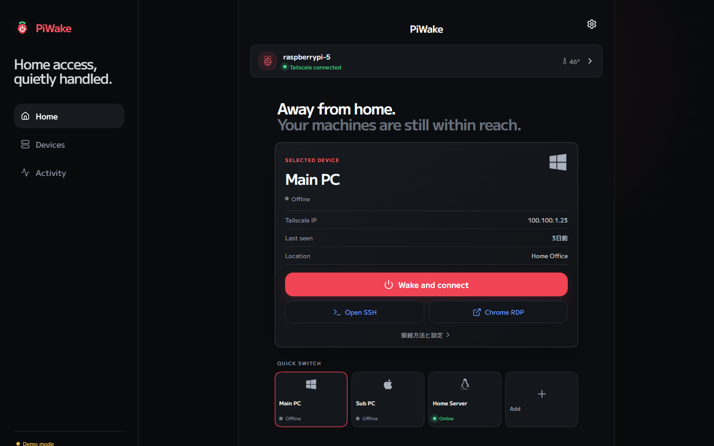
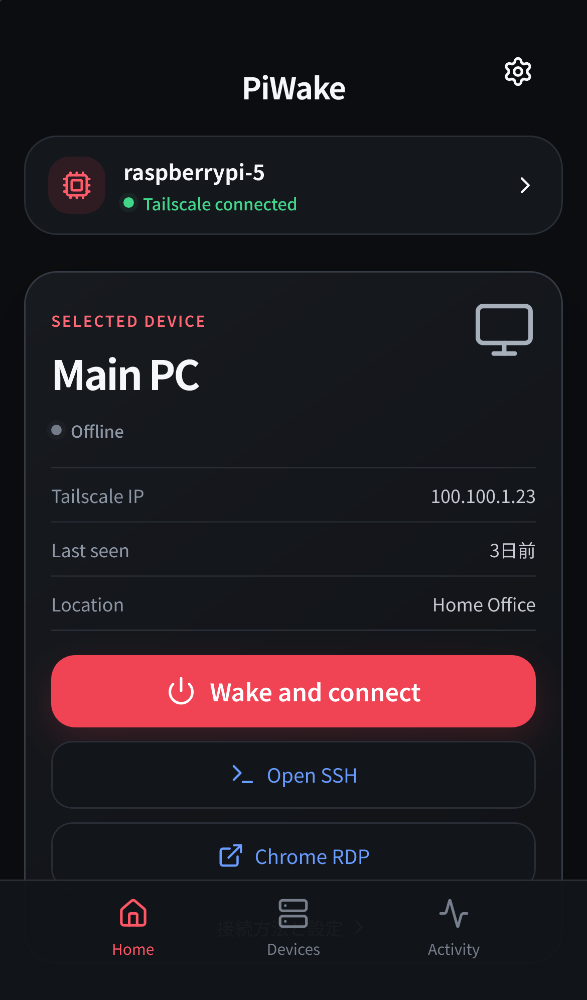

<p align="center"></p>

<p>
  
  
  
  
</p>

PiWake turns a Raspberry Pi into a Wake-on-LAN relay for starting, monitoring, and connecting to devices on your home network from outside the house.
It is designed to run over Tailscale without exposing its management port to the public Internet.

**日本語 README: [README.md](README.md)**

| Desktop | Mobile |
| --- | --- |
|  |  |

## Features

- **Wake-on-LAN tracking**: send a magic packet, then monitor ping and SSH/RDP ports until the device becomes reachable.
- **Scheduled wakes**: start selected devices on specific weekdays and times using the Pi's local clock.
- **Device management**: add, remove, pin, and monitor devices. Status updates are pushed to the web UI with Server-Sent Events.
- **Network scan**: discover candidate devices from the Pi's ARP table.
- **Remote shutdown**: shut down managed machines through key-based SSH, and optionally shut down the Pi itself.
- **Connection shortcuts**: configure SSH, Chrome Remote Desktop, RDP, and custom web URLs for each device. SSH/RDP/web availability can be checked with port probes.
- **Host monitoring**: display CPU temperature, load average, uptime, and Tailscale state.
- **PWA**: install the web interface to a phone home screen; the service worker provides an offline application shell.
- **Native mobile app**: a React Native / Expo client is included under [mobile/](mobile/).
- **Discord bot**: use `/devices`, `/wake`, `/shutdown`, and `/status`. The bot connects outbound to Discord Gateway and does not require an inbound public port.
- **Access control**: use Tailscale ACLs / Grants as the primary network boundary and optionally require a PiWake API token.

## Install on the Pi

Requirements: Linux (Raspberry Pi OS recommended), Node.js 18 or later, and Tailscale.

```bash
git clone https://github.com/nisesimadao/PiWake.git
cd PiWake
bash deploy/install.sh
```

The installer:

1. runs `npm ci` and builds the web console;
2. creates `/etc/default/piwake` unless it already exists; and
3. installs and starts the `piwake` systemd service.

Runtime data is stored under `/var/lib/piwake`.
After installation, open `http://<pi-tailscale-ip>:8787` from a device on the same tailnet.

The API server uses only Node.js standard-library modules such as `http`, `dgram`, `net`, and `child_process`.

### Configuration

| Variable | Default | Description |
| --- | --- | --- |
| `PIWAKE_PORT` | `8787` | API / web console port |
| `PIWAKE_TOKEN` | empty | Optional bearer token. Generate one with `openssl rand -hex 16` and enter the same value in Settings |
| `PIWAKE_BROADCAST` | `255.255.255.255` | Magic-packet broadcast address, for example `192.168.1.255` |
| `PIWAKE_WAKE_TIMEOUT` | `90` | Seconds to wait for a device to become reachable |
| `PIWAKE_STATUS_INTERVAL` | `10` | Device ping interval in seconds |
| `PIWAKE_ALLOWED_HOSTS` | empty | Additional allowed Host headers, comma-separated |

### Remote shutdown

For managed PCs, configure key-based SSH access from the Pi.
On Linux, allow only the required shutdown command through sudo when possible.

To let the service user shut down the Pi itself, add an appropriate sudoers rule, for example:

```text
pi ALL=(root) NOPASSWD: /usr/sbin/shutdown
```

### Discord bot

The Discord integration requires Node.js 22 or later.
Configure it in `/etc/default/piwake`:

```bash
PIWAKE_DISCORD_TOKEN=<Bot token>
PIWAKE_DISCORD_APP_ID=<Application ID>
PIWAKE_DISCORD_GUILD=<Server ID>                 # optional
PIWAKE_DISCORD_ALLOWED_USERS=<Discord user IDs>  # optional
```

If `PIWAKE_DISCORD_ALLOWED_USERS` is not set, consider who can invoke the bot in the Discord server where it is installed.

## Security

PiWake is intended to be reachable through a private Tailscale network rather than a publicly forwarded port.
Use Tailscale ACLs / Grants to restrict who can connect.

For additional application-level protection, set `PIWAKE_TOKEN`.
The server also validates Host headers and JSON Content-Type values to reduce DNS-rebinding and cross-site request risks.

## Development

```bash
npm install
npm run dev        # demo mode without a PiWake API
npm run server     # API only at http://localhost:8787
npm start          # build and serve the API + web console
```

Production builds use the same-origin API by default.
`VITE_*` values are embedded into browser code, so do not place secrets in them.

```bash
npm test
```

Tests use `node:test` for unit and API integration coverage.

## API

| Method | Path | Purpose |
| --- | --- | --- |
| `GET` | `/api/health` | Liveness check; returns whether authentication is required |
| `GET` | `/api/events` | SSE stream for device and wake-job updates |
| `GET` | `/api/host` | Host metrics |
| `POST` | `/api/host/shutdown` | Shut down the Pi |
| `GET` / `POST` | `/api/devices` | List / add devices |
| `PATCH` / `DELETE` | `/api/devices/:id` | Update / remove a device |
| `POST` | `/api/devices/:id/wake` | Send a magic packet and start a wake job |
| `POST` | `/api/devices/:id/shutdown` | Shut down a device over SSH |
| `GET` | `/api/devices/:id/ping` | Run an immediate ping and refresh stored state |
| `GET` | `/api/devices/:id/services` | Probe SSH / RDP / web ports |
| `GET` / `DELETE` | `/api/jobs/:id` | Get wake-job progress / cancel the job |
| `GET` / `POST` | `/api/schedules` | List / add scheduled wakes |
| `PATCH` / `DELETE` | `/api/schedules/:id` | Update / remove a schedule |
| `GET` | `/api/activity` | Return the 50 most recent activity entries |
| `GET` | `/api/scan` | Discover LAN devices from the ARP table |

## Mobile App

The Expo app under `mobile/` uses the same PiWake API as the web interface.
See [mobile/README.md](mobile/README.md) for development and device-build instructions.

## License

[MIT](LICENSE)
