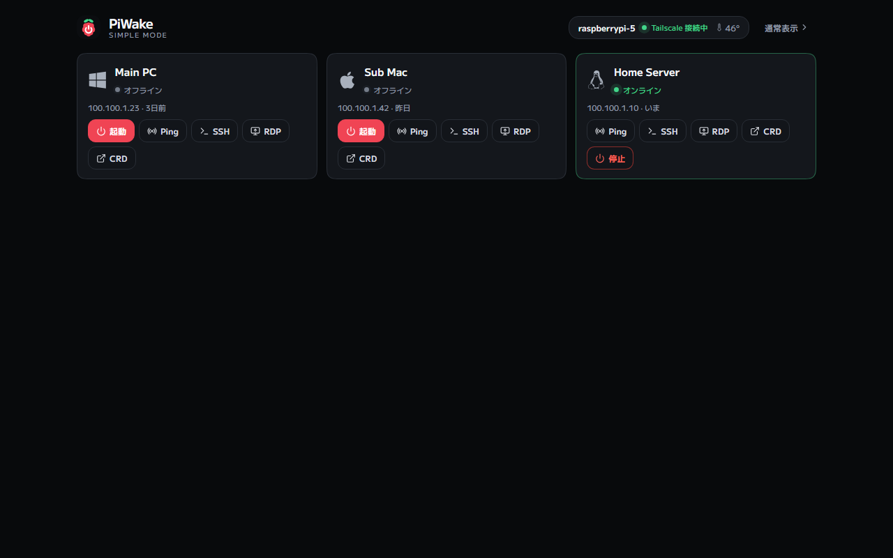

<p align="center"></p>

<p>
  <a href="https://github.com/nisesimadao/PiWake/actions/workflows/ci.yml"></a>
  
  
  
  
</p>

PiWake は、自宅の Raspberry Pi を Wake-on-LAN の中継ホストとして使い、外出先から PC や NAS などのデバイスを起動・監視・接続するセルフホスト型ツールです。
Tailscale 上での利用を前提とし、インターネットへ管理ポートを公開せずに運用できます。

**English README: [README.en.md](README.en.md)**

| Desktop | Mobile |
| --- | --- |
|  |  |

シンプルモード（`/simple`）では、タブを使わずデバイス操作だけを一画面にまとめます。



## 主な機能

- **Wake-on-LAN**：Pi から Magic Packet を送信し、ping と SSH / RDP ポートの応答を確認しながら、起動から接続可能になるまで追跡します。
- **スケジュール Wake**：曜日と時刻を指定して自動起動できます。判定には Pi のローカル時刻を使います。
- **デバイス管理**：追加、削除、ピン留め、10 秒ごとの ping 監視に対応します。状態は SSE で Web UI へ反映します。
- **LAN スキャン**：Pi の ARP テーブルから LAN 内のデバイス候補を取得します。
- **リモートシャットダウン**：鍵認証 SSH を使って管理対象 PC を停止できます。必要な sudoers 設定を行えば Pi 本体も停止できます。
- **接続ショートカット**：SSH、Chrome Remote Desktop、RDP、任意の Web URL をデバイスごとに設定できます。SSH / RDP / Web はポート応答も確認します。
- **ホスト監視**：CPU 温度、ロードアベレージ、稼働時間、Tailscale の状態を表示します。
- **PWA**：Web UI をホーム画面へ追加できます。Service Worker はオフライン用のアプリシェルを保持します。
- **モバイルアプリ**：`mobile/` に React Native / Expo 版を同梱しています。
- **Discord Bot**：`/devices`、`/wake`、`/shutdown`、`/status` などの操作に対応します。Bot は Pi から Discord Gateway へ外向き接続します。
- **認証**：Tailscale ACL / Grants を基本とし、必要に応じて API token を追加できます。Host header と Content-Type も検証します。

## スマートフォンから使う

1. スマートフォンへ [Tailscale](https://tailscale.com/download) をインストールします。
2. Raspberry Pi と同じ tailnet へログインします。
3. `http://<PiのTailscale IP>:8787` を開きます。
4. 必要であればブラウザの「ホーム画面に追加」から PWA として登録します。

Pi の Tailscale IP は、Tailscale の端末一覧から確認できます。

## Wake-on-LAN を使う PC の準備

Wake-on-LAN は対象 PC 側でも有効にする必要があります。

1. BIOS / UEFI で Wake-on-LAN、Power On By PCI-E などの項目を有効にします。
2. Windows ではネットワークアダプターの電源管理と Magic Packet による復帰を許可します。必要に応じて高速スタートアップも無効にします。
3. Wake-on-LAN は有線 LAN での利用を推奨します。Wi-Fi 経由の Wake 機能は機種によって対応状況が異なります。

Chrome Remote Desktop を使う場合は、対象 PC 側で事前に設定してください。

## Raspberry Pi へのセットアップ

必要環境：Linux（Raspberry Pi OS を推奨）、Node.js 18 以上、Tailscale。

```bash
git clone https://github.com/nisesimadao/PiWake.git
cd PiWake
bash deploy/install.sh
```

インストーラーは次の処理を行います。

1. `npm ci` を実行し、Web コンソールをビルドします。
2. `/etc/default/piwake` に設定ファイルを作成します。既存ファイルがある場合は保持します。
3. systemd サービス `piwake` を登録して起動します。状態データは `/var/lib/piwake` に保存します。

完了後、tailnet 内の端末から `http://<PiのTailscale IP>:8787` を開きます。

### 設定（`/etc/default/piwake`）

| 変数 | 既定値 | 説明 |
| --- | --- | --- |
| `PIWAKE_PORT` | `8787` | API / Web コンソールのポート |
| `PIWAKE_TOKEN` | 空 | 任意の API token。`openssl rand -hex 16` などで生成し、Web UI にも同じ値を設定 |
| `PIWAKE_BROADCAST` | `255.255.255.255` | Magic Packet の broadcast address |
| `PIWAKE_WAKE_TIMEOUT` | `90` | Wake 完了を待つ秒数 |
| `PIWAKE_STATUS_INTERVAL` | `10` | デバイス状態を確認する間隔（秒） |
| `PIWAKE_ALLOWED_HOSTS` | 空 | 追加で許可する Host header。カンマ区切り |

設定変更後はサービスを再起動します。

```bash
sudo systemctl restart piwake
journalctl -u piwake -f
```

### Discord Bot（任意）

Discord Bot を使う場合は Node.js 22 以上が必要です。
それより古い Node.js では Bot 機能を無効にします。

1. [Discord Developer Portal](https://discord.com/developers/applications) で Application と Bot を作成します。
2. OAuth2 URL Generator で `bot` と `applications.commands` を選び、対象サーバーへ招待します。
3. `/etc/default/piwake` に必要な値を設定してサービスを再起動します。

```bash
PIWAKE_DISCORD_TOKEN=<Bot token>
PIWAKE_DISCORD_APP_ID=<Application ID>
PIWAKE_DISCORD_GUILD=<Server ID>                 # 任意
PIWAKE_DISCORD_ALLOWED_USERS=<Discord user IDs>  # 任意
```

| コマンド | 動作 |
| --- | --- |
| `/devices` | デバイス選択と Wake / Ping / Shutdown の操作パネルを表示 |
| `/status` | Pi の温度、負荷、稼働時間、Tailscale 状態を表示 |
| `/wake device:<name>` | Magic Packet を送信し、Wake の進行状況を表示 |
| `/shutdown device:<name>` | SSH 経由で対象デバイスを停止 |

`PIWAKE_DISCORD_ALLOWED_USERS` を設定しない場合は、Bot を利用できるサーバーメンバーの範囲に注意してください。

### リモートシャットダウン

管理対象 PC は、Pi から鍵認証 SSH で接続できるようにします。
Linux で `sudo shutdown` を使う場合は、必要なコマンドだけ passwordless sudo を許可してください。

Pi 本体の停止を許可する例：

```text
pi ALL=(root) NOPASSWD: /usr/sbin/shutdown
```

### セキュリティ

PiWake は、管理ポートをインターネットへ直接公開しない構成を想定しています。
アクセス範囲は Tailscale ACL / Grants で制御してください。

追加の保護が必要な場合は `PIWAKE_TOKEN` を設定してください。
Host header の検証は DNS rebinding 対策、JSON Content-Type の検証は cross-site request の抑制に使用します。

## 開発

```bash
npm install
npm run dev        # API を使わない demo mode
```

実際の Pi API へ接続する場合：

```bash
cp .env.example .env.local
# PIWAKE_PROXY_TARGET を Pi の Tailscale URL に設定
npm run dev
```

ローカルで API server も起動する場合：

```bash
npm run server     # API only: http://localhost:8787
npm start          # build + API + Web console
```

production build は同一オリジンの API を使用します。
`VITE_*` はブラウザへ埋め込まれる公開設定なので、秘密情報を保存しないでください。

## API

フロントエンドの API 呼び出しは `src/services/piwakeClient.js` にまとめています。

| Method | Path | Purpose |
| --- | --- | --- |
| `GET` | `/api/health` | 疎通確認。認証不要で `authRequired` を返す |
| `GET` | `/api/events` | SSE。デバイス状態と Wake job の更新 |
| `GET` | `/api/host` | ホストの温度、負荷、稼働時間、Tailscale 状態 |
| `POST` | `/api/host/shutdown` | Pi 本体を停止 |
| `GET` / `POST` | `/api/devices` | デバイス一覧 / 追加 |
| `PATCH` / `DELETE` | `/api/devices/:id` | デバイス更新 / 削除 |
| `POST` | `/api/devices/:id/wake` | Magic Packet を送信して Wake job を開始 |
| `POST` | `/api/devices/:id/shutdown` | SSH 経由で停止 |
| `GET` | `/api/devices/:id/ping` | 即時 ping と状態更新 |
| `GET` | `/api/devices/:id/services` | SSH / RDP / Web の port probe |
| `GET` / `DELETE` | `/api/jobs/:id` | Wake job の進捗 / cancel |
| `GET` / `POST` | `/api/schedules` | scheduled Wake の一覧 / 追加 |
| `PATCH` / `DELETE` | `/api/schedules/:id` | schedule の更新 / 削除 |
| `GET` | `/api/activity` | 直近 50 件の操作履歴 |
| `GET` | `/api/scan` | ARP table から LAN device を取得 |

## 技術構成

- **Server**：Node.js standard library（`http` / `dgram` / `net` / `child_process`）。server runtime に npm dependency はありません。
- **Frontend**：React + Vite + Lucide React。
- **Fonts**：M PLUS 1 を含む Google Fonts を runtime で読み込みます。
- **Deployment**：systemd + `deploy/install.sh`。

## モバイルアプリ

`mobile/` に Expo 版があります。
Web 版と同じ PiWake API を使用し、API URL と token はアプリ内で設定します。

```bash
cd mobile
npm install
npx expo start
```

詳しくは [mobile/README.md](mobile/README.md) を参照してください。

## テスト

```bash
npm test
```

`node:test` を使った unit test と API integration test を実行します。

## 今後の候補

- Web Push / mobile push による background notification。
- EAS Build を使った mobile app の配布。

## License

[MIT](LICENSE)
